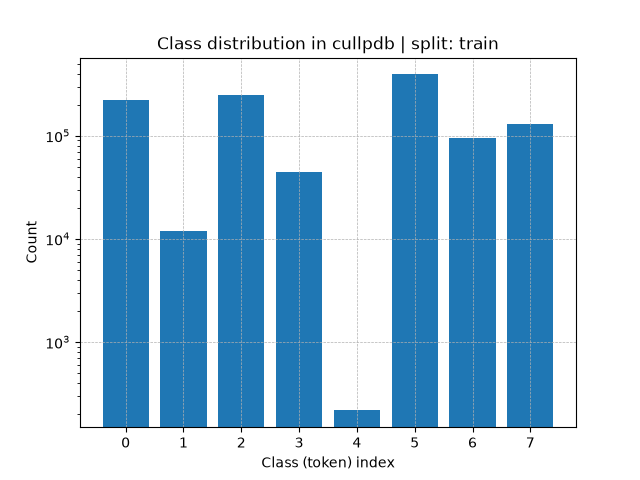

# Predicting protein secondary structure using deep learning

This repository implements deep-learning models to predict protein secondary structure from sequence and profile features. The work follows the experimental setup of established literature and provides data preprocessing, model definitions, training loops, and evaluation utilities.

**Key idea:** assign one of eight secondary-structure labels to each amino-acid residue in a protein sequence. This task can be seen as a sequence labeling problem, where the input is a sequence of amino acids (and associated features) and the output is a sequence of secondary structure labels.

**Paper reference:** https://arxiv.org/abs/1403.1347

**Overview**
This project provides:
- Data pipeline to convert compressed numpy dataset files into processed arrays suitable for training.
- Model architectures in `scripts/models.py` and training logic in `scripts/train.py` and `scripts/trainer.py`.
- Unit tests for dataset processing and model components under `tests/`.

**Project structure**
- `scripts/` : data pipeline, model definitions, training and testing scripts.
- `data/` : place source `*.npy.gz` files here; processed `*.npy` will be written here by the pipeline.
- `results/` : output directory for checkpoints and logs.
- `tests/` : unit tests (`test_datasets.py`, `test_model.py`).
- `config/` : example config files (e.g., `cullpdb_simple1dcnn.yaml`).
- `main.py` : optional entry point.

**Install**
Used https://docs.astral.sh/uv/ for environment management, but you can use any Python environment manager using dependencies from `pyproject.toml`.

```bash
# Install uv if you don't have it
curl -LsSf https://astral.sh/uv/install.sh | sh
```


## Dataset

Get the dataset from https://mega.nz/folder/xct0XSpA#SKz72JtnSAaX61QLMC_JNg. This project expects the following compressed numpy dataset files (provided externally) to be placed in the `data/` folder:
- `cb513+profile_split1.npy.gz` — CB513 test split
- `cullpdb+profile_5926_filtered.npy.gz` — filtered Cull PDB (train+eval for CB513 evaluation)
- `cullpdb+profile_5926.npy.gz` — Cull PDB (train, eval, test)

The repository contains a data pipeline that will convert `*.npy.gz` files into `*.npy` and reshape them for training. To run the conversion:

```bash
uv run scripts/datasets.py
```

After running the pipeline you should find processed `*.npy` files in `data/`. You can also simply place the processed `*.npy` files in `data/` if you already have them.

Dataset sizes (samples, features):

- `cullpdb+profile_5926`: 5926 samples, 39900 features per sample (reshaped to length 700 × feature_dim 57)
- `cullpdb+profile_5926_filtered`: 5365 samples
- `cb513+profile_split1`: 514 samples

When training, the data loading pipeline will automaticaly reshape the data to `(num_samples, 700, 57)`, each sample will then be a sequence of length 700 with 57 features per residue, where these features include:
- 21 one-hot encoded amino-acid sequence features + NoSeq attribute that indicates padding (22 features)
- 8 one-hot encoded secondary structure labels (Q8) + NoSeq attribute that indicates padding (9 features)
- 2 one-hot encoded terminal features (N-terminal, C-terminal)
- 2 solvent accessibility features (not considered in this work)
- 22 PSSM features
of all these features, the model will use only the amino-acid sequence, terminals, and PSSM features as input (resulting in `46` features), and will predict the secondary structure labels.

Run dataset unit tests:

```bash
# Test data loading pipeline
uv run pytest tests/test_datasets.py
```

When running `datasets.py`, the script will also create a bar chart showing the distribution of secondary structure labels in the dataset. see folder `results/distrib`. See the following figures:

|  | 

As you can see, the distribution of secondary structure labels is imbalanced, with some classes being underrepresented.


## Models

Run model unit tests:

```bash
# Test model input/output shapes and forward pass
uv run pytest tests/test_model.py
```

**Simple1DCNN**
Takes the amino-acid sequence (one-hot encoded), terminals, and PSSM features as input and predicts secondary structure labels. The architecture is a simple 1D CNN with configurable number of convolutional layers, kernel sizes, and hidden channels. See `scripts/simplecnn.py` for details.

```bash
-> input: (batch_size, 700, 46)
-> conv layers + classification head
-> output: (batch_size, 700, 8)
```

The basic block is composed as a standard `Conv1d -> BatchNorm1d -> ReLU`. The final classification head is a single `Conv1d` layer with kernel size 1 and output channels equal to the number of classes (8). Each convolution has a modifiable kernel size and a 'same' padding to preserve the sequence length.

**CustomCNN**
Takes the amino-acid sequence (one-hot encoded), terminals, and PSSM features as input and predicts secondary structure labels in separate branches, then fuses, and applies a configurable number of convolutional layers, kernel sizes, and hidden channels.

- Amino-acid sequence is processed through an embedding layer.
- PSSM features are projected to the same embedding dimension through a linear layer.

Once we have the embeddings from both branches, we concatenate them with the terminals features, project them with a linear layer to the hidden dimension, and feed them into a configurable number of convolutional layers with skip connections, followed by a final classification head (same as Simple1DCNN + dilation in convolutional layers). See `scripts/customcnn.py` for details. What changes with this architecture is the choice of letting the model learn separate representations for sequence and profile features before fusing them, which may improve performance.

```bash
-> input: (batch_size, 700, 46)
-> separate branches for sequence and PSSM features
  -> sequence branch: embedding layer -> (batch_size, 700, embed_dim)
  -> PSSM branch: linear layer -> (batch_size, 700, embed_dim)
-> concatenate branches with terminals features -> (batch_size, 700, 2 * embed_dim + 2)
-> linear projection: (batch_size, 700, hidden_dim)
-> dilated conv layers with skip connections: (batch_size, 700, hidden_dim)
-> classification head: (batch_size, 700, 8)
```

This way we'll let the model learn something more about each amino-acid in the vocabulary. The dilated convolutions in the convolutional layers will allow the model to partially capture longer-range dependencies in the sequence, with this architecture we're attempting to improve the model's ability to understand the context of each amino-acid in the sequence, hence building a better representation.

## Training

**Launch training**
Train a model using a configuration file:

```bash
# Train Simple1DCNN
uv run scripts/train.py --config cullpdb_simple1dcnn.yaml
uv run scripts/train.py --config cullpdb_filtered_simple1dcnn.yaml

# Train CustomCNN
uv run scripts/train.py --config cullpdb_customcnn.yaml
uv run scripts/train.py --config cullpdb_filtered_customcnn.yaml
```

Once training is complete, you will see a new folder `results/logs` containing the final validation report.

**Test**
```bash
# Test Simple1DCNN
uv run scripts/test.py --config cullpdb_simple1dcnn.yaml
uv run scripts/test.py --config cullpdb_filtered_simple1dcnn.yaml

# Test CustomCNN
uv run scripts/test.py --config cullpdb_customcnn.yaml
uv run scripts/test.py --config cullpdb_filtered_customcnn.yaml
```

| Model       | cullpdb (accuracy) | cullpdb (F1) | cb513 (accuracy) | cb513 (F1) |
| ----------- | ------- | ----- | ----- | ----- |
| Simple1DCNN | .       | .     | .     | .     |
| CustomCNN   | .       | .     | .     | .     |


## Conclusions and improvements

- [ ] Early stopping strategy
- [ ] Qualitative charts for model testing
- [ ] Bidirectional LSTM to better capture long-range dependencies in the sequence
- [ ] Transformer encoder to capture long-range dependencies in the sequence
- [ ] Different los function than cross-entropy, applying weights doesn't work at all
