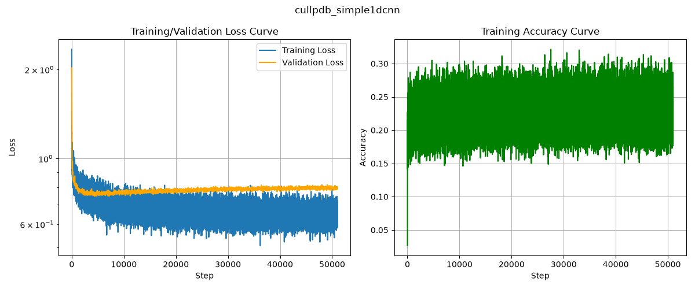
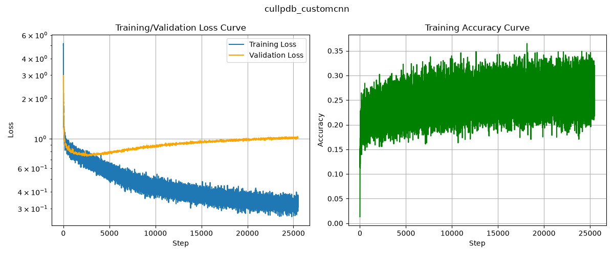
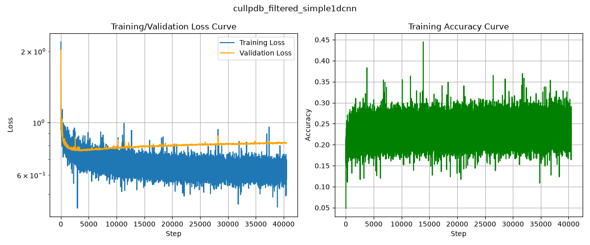
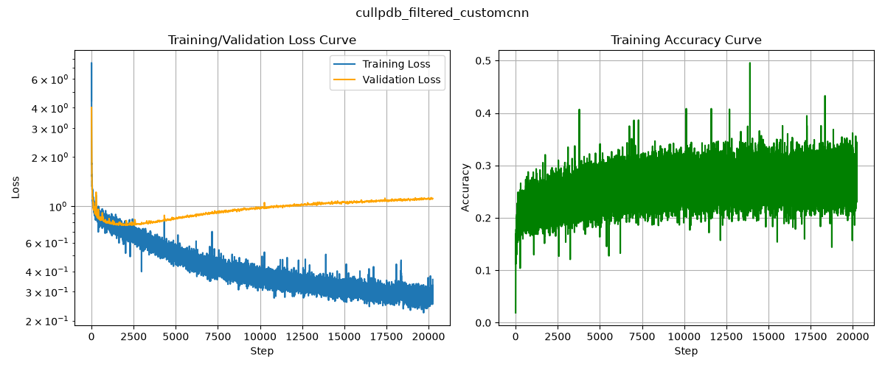

# Predicting protein secondary structure using deep learning

This repository implements deep-learning models to predict protein secondary structure from sequence and profile features. The work follows the experimental setup of established literature and provides data preprocessing, model definitions, training loops, and evaluation utilities.

**Key idea:** assign one of eight secondary-structure labels to each amino-acid residue in a protein sequence. This task can be seen as a sequence labeling problem, where the input is a sequence of amino acids (and associated features) and the output is a sequence of secondary structure labels.

**Paper reference:** https://arxiv.org/abs/1403.1347

**Overview**
This project provides:
- Data pipeline to convert compressed numpy dataset files into processed arrays suitable for training.
- Model architectures in `scripts/models.py` and training logic in `scripts/train.py` and `scripts/trainer.py`.
- Testing pipeline in `scripts/test.py` to evaluate model performance.
- Unit tests for dataset processing and model components under `tests/`.

**Project structure**
- `scripts/` : data pipeline, model definitions, training and testing scripts.
- `data/` : place source `*.npy.gz` files here; processed `*.npy` will be written here by the pipeline.
- `results/` : output directory for checkpoints and logs.
- `tests/` : unit tests (`test_datasets.py`, `test_model.py`).
- `config/` : example config files (e.g., `cullpdb_simple1dcnn.yaml`).
- `main.py` : optional entry point.

**Install**
Used https://docs.astral.sh/uv/ for environment management, but you can use any Python environment manager using dependencies from `pyproject.toml`.

```bash
# Install uv if you don't have it
curl -LsSf https://astral.sh/uv/install.sh | sh

# Launch the whole pipeline (dataset preparation, training, and testing)
chmod +x launch.sh
./launch.sh
```


## Dataset

Get the dataset from https://mega.nz/folder/xct0XSpA#SKz72JtnSAaX61QLMC_JNg. This project expects the following compressed numpy dataset files (provided externally) to be placed in the `data/` folder:
- `cb513+profile_split1.npy.gz` — CB513 test split
- `cullpdb+profile_5926_filtered.npy.gz` — filtered Cull PDB (train+eval for CB513 evaluation)
- `cullpdb+profile_5926.npy.gz` — Cull PDB (train, eval, test)

The repository contains a data pipeline that will convert `*.npy.gz` files into `*.npy` and reshape them for training. To run the conversion:

```bash
# .npy conversion, reshaping, and distribution plotting
# --dataset_name will be used for distribution plotting
uv run scripts/datasets.py --dataset_name cullpdb
uv run scripts/datasets.py --dataset_name cullpdb_filtered
```

After running the pipeline you should find processed `*.npy` files in `data/`. You can also simply place the processed `*.npy` files in `data/` if you already have them.

Dataset sizes (samples, features):

- `cullpdb+profile_5926`: 5926 samples, 39900 features per sample (reshaped to length 700 × feature_dim 57) - train/eval/test splits already known
- `cullpdb+profile_5926_filtered`: 5365 samples - eval split will be 20% of the dataset
- `cb513+profile_split1`: 514 samples

When training, the data loading pipeline will automaticaly reshape the data to `(num_samples, 700, 57)`, each sample will then be a sequence of length 700 with 57 features per residue, where these features include:
- 21 one-hot encoded amino-acid sequence features + NoSeq attribute that indicates padding (22 features)
- 8 one-hot encoded secondary structure labels (Q8) + NoSeq attribute that indicates padding (9 features)
- 2 one-hot encoded terminal features (N-terminal, C-terminal)
- 2 solvent accessibility features (not considered in this work)
- 22 PSSM features
of all these features, the model will use only the amino-acid sequence, terminals, and PSSM features as input (resulting in `46` features), and will predict the secondary structure labels.

When running `datasets.py`, the script will also create a bar chart showing the distribution of secondary structure labels in the dataset. see folder `results/distrib`. See the following figures:

| | |
| --- | --- |
|  |  |

As you can see, the distribution of secondary structure labels is imbalanced, with some classes being underrepresented. For this reason we'll use F1 score to evaluate the model's performance, as it is a better metric for imbalanced datasets than accuracy.

Run dataset unit tests:

```bash
# Test data loading pipeline
uv run pytest tests/test_datasets.py
```


## Models

To address this problem the approach will be step-by-step building models of increasing complexity, starting with a simple 1D CNN and then moving to a custom architecture that processes sequence and profile features separately before fusing them. More approaches will be added in the future, see the "Conclusions and improvements" section at the end of this README.

**Simple1DCNN**
Takes the amino-acid sequence (one-hot encoded), terminals, and PSSM features as input and predicts secondary structure labels. The architecture is a simple 1D CNN with configurable number of convolutional layers, kernel sizes, and hidden channels. See `scripts/simplecnn.py` for details.

```bash
-> input: (batch_size, 700, 46)
-> conv layers + classification head
-> output: (batch_size, 700, 8)
```

The basic block is composed as a standard `Conv1d -> BatchNorm1d -> ReLU`. The final classification head is a single `Conv1d` layer with kernel size 1 and output channels equal to the number of classes (8). Each convolution has a modifiable kernel size and a 'same' padding to preserve the sequence length.

**CustomCNN**
Takes the amino-acid sequence (one-hot encoded), terminals, and PSSM features as input and predicts secondary structure labels in separate branches, then fuses, and applies a configurable number of convolutional layers, kernel sizes, and hidden channels.

- Amino-acid sequence is processed through an embedding layer.
- PSSM features are projected to the same embedding dimension through a linear layer.

Once we have the embeddings from both branches, we concatenate them with the terminals features, project them with a linear layer to the hidden dimension, and feed them into a configurable number of convolutional layers with skip connections, followed by a final classification head (same as Simple1DCNN + dilation in convolutional layers). See `scripts/customcnn.py` for details. What changes with this architecture is the choice of letting the model learn separate representations for sequence and profile features before fusing them, which may improve performance.

```bash
-> input: (batch_size, 700, 46)
-> separate branches for sequence and PSSM features
  -> sequence branch: embedding layer -> (batch_size, 700, embed_dim)
  -> PSSM branch: linear layer -> (batch_size, 700, embed_dim)
-> concatenate branches with terminals features -> (batch_size, 700, 2 * embed_dim + 2)
-> linear projection: (batch_size, 700, hidden_dim)
-> dilated conv layers with skip connections: (batch_size, 700, hidden_dim)
-> classification head: (batch_size, 700, 8)
```

This way we'll let the model learn something more about each amino-acid in the vocabulary. The dilated convolutions in the convolutional layers will allow the model to partially capture longer-range dependencies in the sequence, with this architecture we're attempting to improve the model's ability to understand the context of each amino-acid in the sequence, hence building a better representation. Compared to the baseline model, we have the following additional components:

- Sequence embedding layer: instead of using one-hot encoded amino-acid sequences, we use an embedding layer to learn a dense representation for each amino-acid in the vocabulary. This allows the model to capture more complex relationships between amino-acids and their properties.
- PSSM linear projection: instead of using the raw PSSM features, we project them to the same embedding dimension as the sequence features to match with the sequence features and to scale them. This allows the model to learn a more compact representation of the PSSM features and potentially capture more complex relationships between them and the sequence features.
- Dilated convolutions: instead of using standard convolutions, we use dilated convolutions in the convolutional layers to capture longer-range dependencies in the sequence. This allows the model to capture more context for each amino-acid in the sequence and potentially improve its ability to predict secondary structure labels.

Run model unit tests:

```bash
# Test model input/output shapes and forward pass
uv run pytest tests/test_model.py
```

## Training

**Launch training**
Train a model using a configuration file (`scripts/config/*.yaml`):

```bash
# Train Simple1DCNN
uv run scripts/train.py --config cullpdb_simple1dcnn.yaml
uv run scripts/train.py --config cullpdb_filtered_simple1dcnn.yaml

# Train CustomCNN
uv run scripts/train.py --config cullpdb_customcnn.yaml
uv run scripts/train.py --config cullpdb_filtered_customcnn.yaml
```

Once training is complete, you will see a new folder `results/logs` containing the final validation report.

**Results**

| Simple1DCNN | CustomCNN |
| ----------- | --------- |
|  |  |
|  |  |

Check [`results/logs`](results/logs) for the final validation report, which contains accuracy and F1 scores for each class, full classification report, and confusion matrix. See the following table for a summary of the validation results:

| Model       | `cullpdb` (accuracy) | `cullpdb` (micro F1) | `cullpdb_filtered` (accuracy) | `cullpdb_filtered` (micro F1) |
| ----------- | -------------------- | -------------------- | ----------------------------- | ----------------------------- |
| Simple1DCNN | 0.22                 | 0.33                 | 0.22                          | 0.34                          |
| CustomCNN   | 0.21                 | 0.33                 | 0.22                          | 0.33                          |


The CustomCNN training is shorter than Simple1DCNN due to the high computational cost. An early stopping strategy might be employed to avoid overfitting, but for now we just train for a fixed number of epochs.
Training will save the checkpoint that will be used for testing in `results/checkpoints`.

**Test**
```bash
# Test Simple1DCNN
uv run scripts/test.py --config cullpdb_simple1dcnn.yaml
uv run scripts/test.py --config cullpdb_filtered_simple1dcnn.yaml

# Test CustomCNN
uv run scripts/test.py --config cullpdb_customcnn.yaml
uv run scripts/test.py --config cullpdb_filtered_customcnn.yaml

# NOTE: by giving cullpdb_filtered as dataset name, the test script will automatically use the model trained on cullpdb_filtered, and evaluate it on the cb513 dataset, since the cullpdb_filtered dataset is meant to be an evaluation set for cb513.
```

| Model       | cullpdb (accuracy) | cullpdb (micro F1) | cb513 (accuracy) | cb513 (micro F1) |
| ----------- | ------------------ | ------------------ | ---------------- | ---------------- |
| Simple1DCNN | 0.22               | 0.33               | 0.16             | 0.26             |
| CustomCNN   | 0.21               | 0.33               | 0.15             | 0.25             |

Check [`results/test`](results/test) for the final testing report, which contains accuracy and F1 scores for each class, full classification report, confusion matrix, and samples alignments. Employing en early stopping strategy might be beneficial to avoid overfitting, but so far by looking at the learning curves is not that evident.


## Conclusions and improvements

Looking at the test reports, for both Simple1DCNN and CustomCNN, the F1 score for each class aren't uniform, especially for underrepresented classes, which is expected given the imbalanced distribution of secondary structure labels in the dataset. This suggests that the model may be biased towards predicting the more common classes, and may struggle to accurately predict the underrepresented classes.

**CustomCNN analysis**
The CustomCNN architecture didn't perform well, which may be due to the fact that the model is not able to learn good representations for sequence and profile features with the current training setup, or that the fusion strategy is not effective. On one side, it may require more careful tuning of hyperparameters, such as learning rate, batch size, and model architecture (e.g., embedding dimension, hidden dimension, number of convolutional layers, kernel sizes). On the other hand, it may require a different training strategy, such as a different loss function tailored for an imbalanced dataset.

The first training attempt aimed at reaching the interpolation threshold, over 300 epochs this was unsuccessful, this may support the idea that the model is not able to learn good representations for sequence but also that learning here is very slow, which may be due to the fact that the model is not able to effectively capture the relationships between sequence and profile features with the current architecture and training setup, which might be due to the class imbalance. For learning those representations, a longer training might be necessary, as well as moving to a different training setup as we're getting closer to a pretraining rather than a supervised training.

**Potential Improvements**
- [ ] Place a bidirectional LSTM on top of the convolutional layers to better capture long-range dependencies in the sequence
- [ ] Transformer encoder to improve over the BiLSTM to capture long-range dependencies in the sequence
- [ ] Load a pretraining model for the sequence branch, such as a protein language model, and finetune it on the secondary structure prediction task, this might help the model learn better representations for the sequence features, which is crucial for this task
- [ ] Different loss function than cross-entropy (cross-entropy weights don't seem to help much), focal loss might be a good attempt
- [ ] Start with a higher learning rate and a learning rate scheduler, see if it helps to speedup training
- [ ] Sequence length is set to 700, might be worth trying to halve it to generate one more sample per protein

Effective number of samples is around 1M, CustomCNN has around 2M parameters, which means that we're in the over-parametrized regime, with a longer training horizon we should reach the interpolation threshold. Might be interesting to push the model to interpolate the training data, to get some insights on this task.

Also, the training logic and results might be improved as follows:
- [ ] Add learning rate scheduler
- [ ] Early stopping strategy
- [ ] Integrate Optuna for tuning optimizer learning rate
- [ ] Qualitative charts for model testing (only on test logs so far)
- [ ] Inference using an end-point where one can provide an amino-acid sequence and get the predicted secondary structure as output
